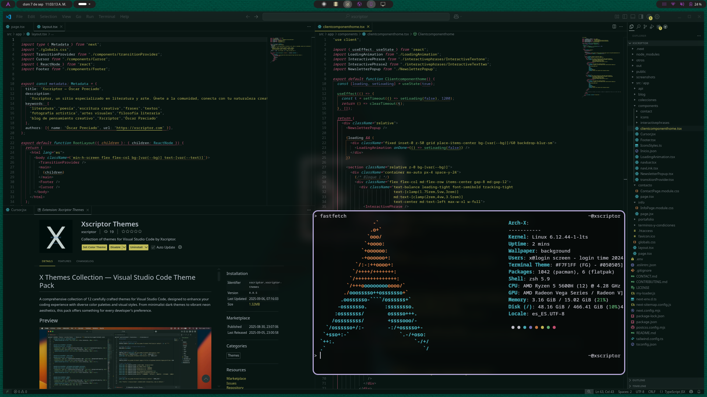
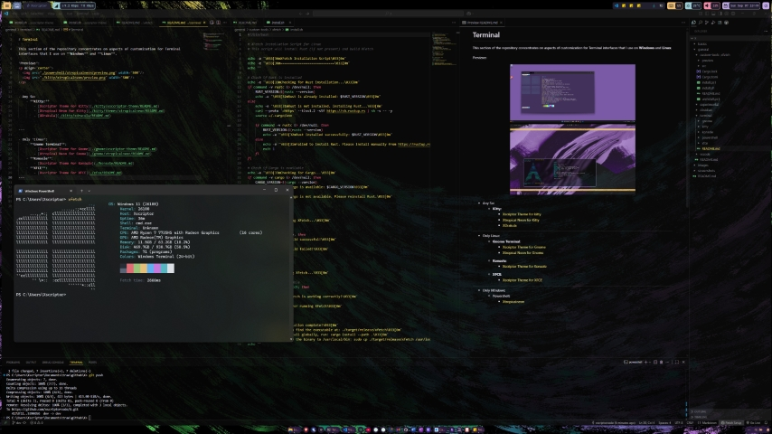

# X

### *Repository for system customizations and automation*.

  

  

## Structure:

- [Basics](./basics/readme.md) *Includes post-installation scripts, applications, and documentation of installation processes that I regularly use on daily-use systems.*
- [General](./general/README.md) *Includes specific customizations for application interfaces that I regularly use in my daily-use system.*
- [Images](./images/README.md) *Backgrounds*

