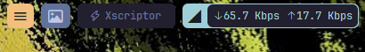

# Configuration files for topbar

## Previews:

  
  
  

- Instructions:
     - Download the files or create config.yaml and styles.css in the config folder:
     - Replace the content.
     - Restart Yasb

[configuration](./config/config.yaml)

[Styles](./config/styles.css)