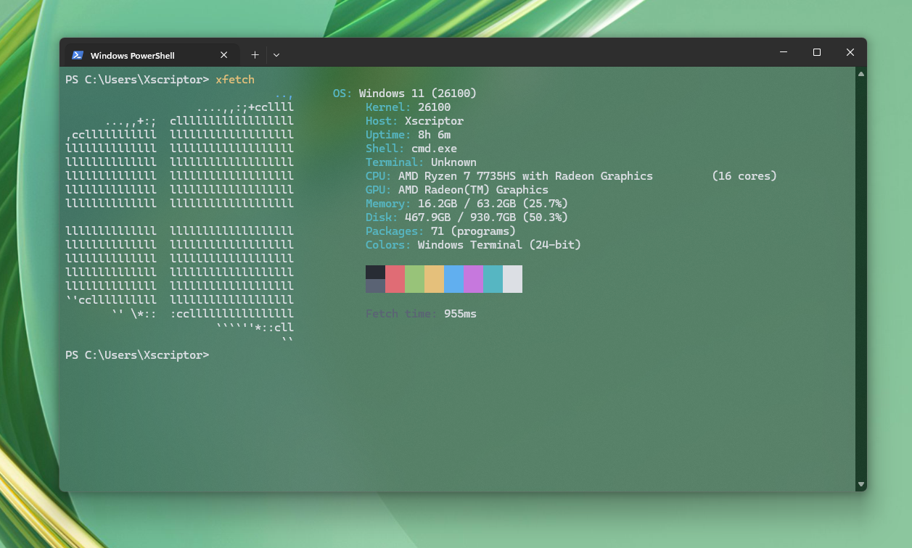

# XFetch

A system information tool similar to fastfetch, written in Rust. XFetch displays relevant system information with colorful output and ASCII logos for different operating systems.

<p align="center">
  
</p>


## Features

- **Cross-platform support**: Works on Windows and Linux
- **System information display**: OS, kernel, hostname, uptime, CPU, memory, disk usage
- **Colorful output**: Uses colored text for better readability
- **ASCII logos**: Different logos for various operating systems (Windows, Ubuntu, Debian, Fedora, Arch, etc.)
- **Performance timing**: Shows execution time at the end
- **Shell and terminal detection**: Displays current shell and terminal information

## Installation

### Prerequisites

First, you need to install Rust. Visit [rustup.rs](https://rustup.rs/) and follow the installation instructions for your operating system.

#### Windows
1. Download and run the Rust installer from https://rustup.rs/
2. Follow the installation wizard
3. Restart your terminal or command prompt

#### Linux
```bash
curl --proto '=https' --tlsv1.2 -sSf https://sh.rustup.rs | sh
source ~/.cargo/env
```

### Building XFetch

1. Clone or download this repository
2. Navigate to the project directory
3. Build the project:

```bash
cargo build --release
```

### Installation

#### Automatic Installation (Windows)

For Windows users, we provide an automated installation script that will:
- Build the project
- Install XFetch globally to your system
- Add it to your PATH automatically
- Allow you to run `xfetch` from any terminal

Run the installation script:

```powershell
powershell -ExecutionPolicy Bypass -File .\install.ps1
```

After installation, restart your terminal and you can use `xfetch` from anywhere.

#### Manual Installation

After building, you can install XFetch globally:

```bash
cargo install --path .
```

Or copy the binary from `target/release/xfetch` to a directory in your PATH.

#### Uninstallation (Windows)

To uninstall XFetch from Windows:

```powershell
powershell -ExecutionPolicy Bypass -File .\uninstall.ps1
```

This will remove XFetch from your system and clean up the PATH.

## Usage

Simply run the command:

```bash
xfetch
```

The tool will display:
- ASCII logo for your operating system
- Operating system name and version
- Kernel version
- Hostname
- System uptime
- Shell information
- Terminal information
- CPU information
- Memory usage
- Disk usage
- Execution time

## Example Output

```
                                ..,        OS: Windows 11 22H2
                    ....,,:;+ccllll        Kernel: 10.0.22621
      ...,,+:;  cllllllllllllllllll        Host: DESKTOP-ABC123
,cclllllllllll  lllllllllllllllllll        Uptime: 2h 34m
llllllllllllll  lllllllllllllllllll        Shell: powershell
llllllllllllll  lllllllllllllllllll        Terminal: WindowsTerminal
llllllllllllll  lllllllllllllllllll        CPU: Intel Core i7-10700K (16 cores)
llllllllllllll  lllllllllllllllllll        Memory: 8.2GB / 16.0GB (51.2%)
llllllllllllll  lllllllllllllllllll        Disk: 245.8GB / 500.0GB (49.2%)

Fetch time: 12.34ms
```

## Supported Operating Systems

XFetch includes ASCII logos for:
- Windows
- Ubuntu
- Debian
- Fedora
- Arch Linux
- CentOS/RHEL
- openSUSE
- Linux Mint
- Manjaro
- Generic Linux
- Unknown OS (fallback)

## Dependencies

- `sysinfo`: System information gathering
- `colored`: Colored terminal output
- `chrono`: Date and time handling
- `regex`: Regular expression support
- `winapi` (Windows only): Windows API access
- `libc` (Unix only): Unix system calls

## License

MIT License - see LICENSE file for details.

## Contributing

Contributions are welcome! Please feel free to submit pull requests or open issues for bugs and feature requests.