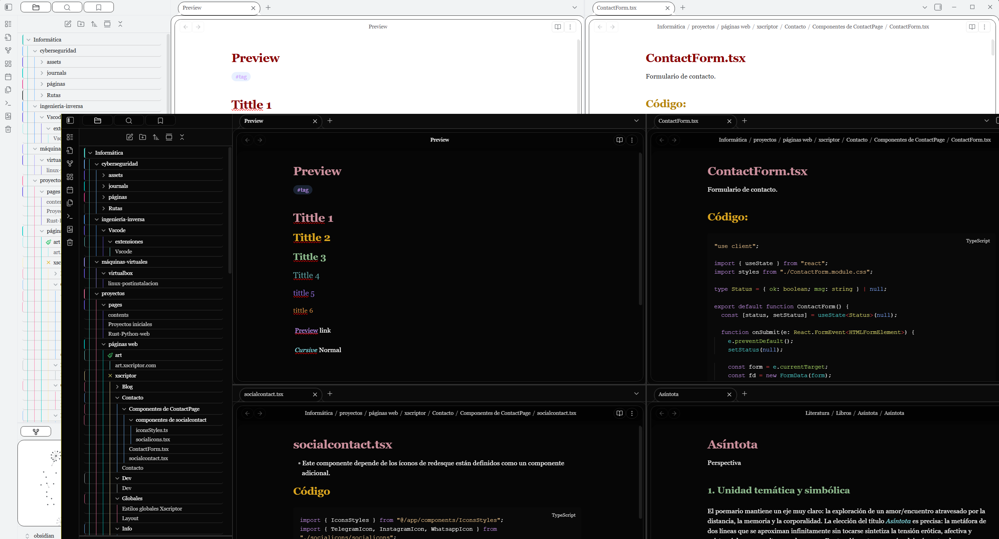

# Xscriptor Theme

An elegant Obsidian theme for coders and writers with beautiful typography, and comprehensive customization options.

## Instructions:
   - Download the [zip file](./download/Xscriptor%20Theme.zip) 
   - Extract
   - Paste in the .obsidian/themes/ folder inside of your vault
   - Restart obsidian.
   - Open Settings, Aparience, Themes and select Xscriptor Theme.
      - Note: the folder needs to have the same name *Xscriptor Theme*. 

## Features

- **EB Garamond Typography**: Elegant and readable serif font
- **Pseudo-Mica Transparency**: Frosted glass effect with backdrop blur
- **Dual Mode Support**: Optimized light and dark color palettes
- **Automatic Folder Colors**: Visual organization with cycling color system
- **Rounded Borders**: Modern UI with customizable border radius
- **Enhanced Code Blocks**: Improved syntax highlighting with better contrast
- **Style Settings Integration**: Complete customization control

## Customization Options

### Transparency Effects
- **Background Opacity**: Control overall transparency (0.1-1.0)
- **Pseudo Mica Effect**: Toggle frosted glass appearance
- **Blur Intensity**: Adjust backdrop-filter blur (5-50px)

### Colors & Typography
- **Accent Color**: Primary theme color
- **Heading Colors**: Customizable H1, H2, H3 colors
- **Italic Text Color**: Special styling for emphasized text
- **Font Size**: Adjustable from 12-24px
- **Line Height**: Configurable spacing (1.2-2.0)

### Interface
- **Border Radius**: Element roundness (0-20px)
- **Folder Colors**: Toggle automatic color cycling
- **Code Block Styling**: Enhanced readability in both themes

## Installation

1. Download the theme files
2. Place `theme.css` in your Obsidian themes folder:
   - **Windows**: `%APPDATA%\Obsidian\themes\Xscriptor Theme\`
   - **macOS**: `~/Library/Application Support/obsidian/themes/Xscriptor Theme/`
   - **Linux**: `~/.config/obsidian/themes/Xscriptor Theme/`
3. Enable the theme in Settings → Appearance → Themes
4. Install the "Style Settings" plugin for full customization access

## Requirements

- **Obsidian**: v0.16.0 or higher
- **Style Settings Plugin**: Recommended for customization
- **Modern Browser**: Supports `backdrop-filter` for transparency effects

## Tips

- Pseudo-mica effects work best on Windows 11 with compatible hardware
- Folder colors automatically cycle through 9 different hues
- Code blocks feature improved contrast in both light and dark modes
- All transparency effects can be disabled for better performance

## Known Issues

- Transparency effects may impact performance on older devices
- Some transparency features require hardware acceleration

## License

MIT License - Feel free to modify and distribute

---

**Created by Xscriptor** | [Report Issues](https://github.com/xscriptordev/obsidian/issues)
**To download from the source** | [View on GitHub](https://github.com/xscriptordev/obsidian/)