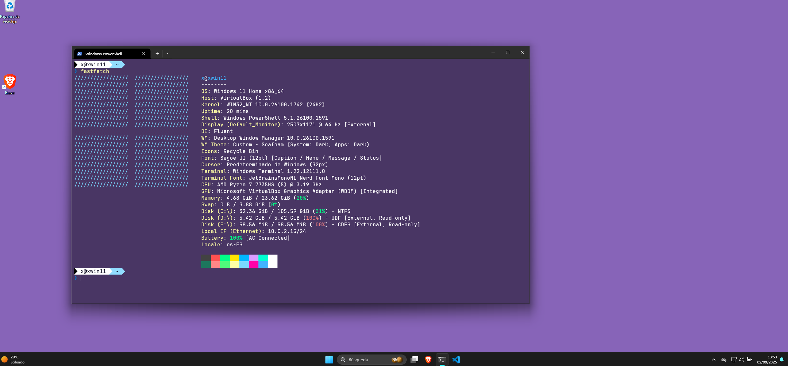
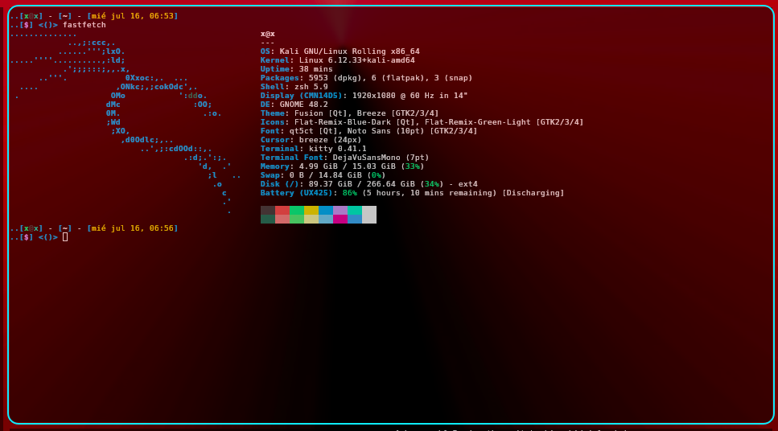

# Terminal

This section of the repository concentrates on aspects of customization for Terminal interfaces that I use on **Windows** and **Linux**.

*Previews*:

  
  

- Any So:
    - **Kitty**:
        - [Xscriptor Theme for kitty](./kitty/xscriptor-theme/README.md)
        - [Xtropical Neon for Kitty](./kitty/themes/xtropicalneon/README.md)
        - [XDrakula](./kitty/xdracula/README.md)
        

---

- Only *Linux*:
    - **Gnome Terminal**:
        - [Xscriptor Theme for Gnome](./gnome/xscriptor-theme/README.md)
        - [Xtropical Neon for Gnome](./gnome/xtropicalneon/README.md)
    - **Konsole**:
        - [Xscriptor Theme for Konsole](./konsole/README.md)
    - **XFCE**:
        - [Xscriptor Theme for XFCE](./xfce/README.md)
---

- Only *Windows*:
    - **Powershell**:
        - [Xtropicalneon](./powershell/xtropicalneon/README.md)

