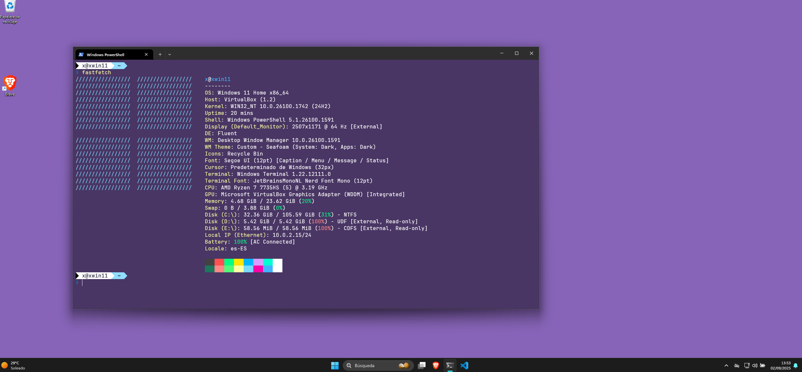

# Xtropicalneon for Powershell

## Preview:


---

## Instructions:
1. Add this under "schemes": [ ... ] in your settings.json:

<details>
<summary>schemes</summary>

```json
{
  "name": "XtropicalNeon",
  "background": "#000000",
  "foreground": "#FFFFFF",
  "cursorColor": "#FFFFFF",
  "selectionBackground": "#00FFD1",

  "black":   "#424242",
  "red":     "#FF5151",
  "green":   "#00FF87",
  "yellow":  "#FFE600",
  "blue":    "#00B7FF",
  "purple":  "#D99DFF",
  "cyan":    "#00FFD1",
  "white":   "#FFFFFF",

  "brightBlack":   "#1D765D",
  "brightRed":     "#FF8787",
  "brightGreen":   "#50FA7B",
  "brightYellow":  "#FFFFA5",
  "brightBlue":    "#79D9FF",
  "brightPurple":  "#FF00A8",
  "brightCyan":    "#41B3FF",
  "brightWhite":   "#FFFFFF"
}

```

</details>

2. Inside "profiles": { "list": [ ... ] } add or edit your PowerShell profile like this:

<details>
<summary>profiles</summary>

```json
{
  "guid": "{12345678-aaaa-bbbb-cccc-123456789abc}",   // use your existing GUID if you already have one
  "name": "PowerShell",
  "commandline": "pwsh.exe",                         // or "powershell.exe" if you use the classic version
  "colorScheme": "XtropicalNeon",
  "fontFace": "JetBrainsMono Nerd Font",
  "fontSize": 12,
  "useAcrylic": true,
  "acrylicOpacity": 0.65,
  "cursorShape": "bar",
  "copyOnSelect": true,
  "padding": "8, 8, 8, 8"
}
```

</details>

3. **Optional** global setting

<details>
<summary>schemes</summary>

```json

"showTabsInTitlebar": true,
"alwaysShowTabs": false

```

</details>

*This is just the example.*